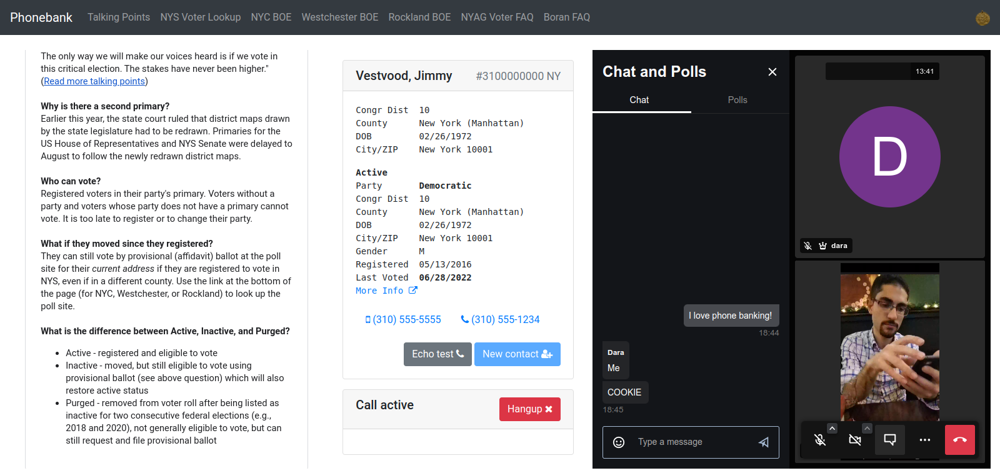

# boran

Boran is a web app for telephone canvassing (phonebanking) intended for getting out the vote.

The backend is implemented as a Python/Django app with voter and volunteer (agent) records in a SQL database.
The frontend is a single page app using JavaScript/jQuery, WebRTC, and optionally Jitsi Meet.

## Developing

(hastily written but feedback is welcome)

## Copyright

Copyright 2020-2025 Dara Adib.

This project is licensed under the terms of the GNU Affero General Public License, either version 3 of the License, or (at your option) any later version.
